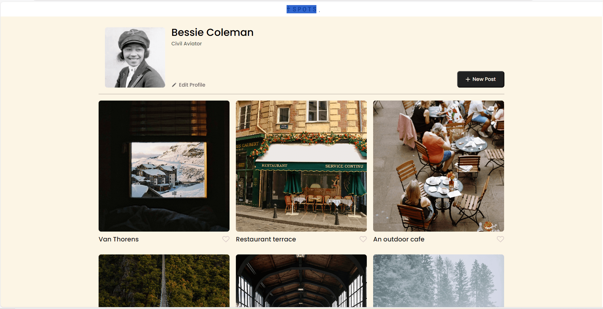

# Spots

Online media app

## Description

An interactive social media web application where users can add and remove photos, like photos of other users, and make personal adjustments to their profile.

## TECH STACK

- HTML
- CSS
- RESPONSIVE DESIGN
- BEM
- GIT/GITHUB
- VSCODE
- FIGMA

## Pictures

## Deplyment

Web page deployed through Github pages

link - https://joelqui15.github.io/se_project_spots/

## Video Content

Break down video of the webpage

link - https://drive.google.com/file/d/1-DPsHf-JoIMETQVDfv6H_8ep1wpvXgZk/view?usp=sharing
